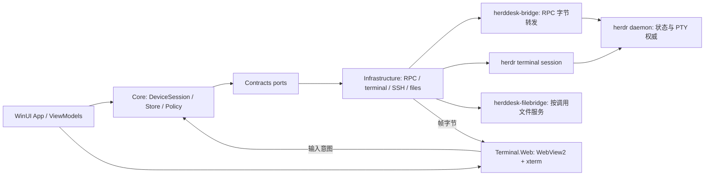

# 总体设计：从 G0 骨架到完整 Windows 工作台

## 基线与目标结构

现有实现边界见 [research/current-state.md](research/current-state.md)，原架构依据 `docs/plan/docs/03_架构与数据流.md:64`。所有新增模块均为拟建，不是当前事实。沿用模块化单体：WinUI 外壳、C# 领域层、少量专职 sidecar，不引入服务器/云同步/数据库服务。

图中 ports 是编译依赖边界，运行时实例由 App composition root 组装。Contracts 仅 BCL；Core 只依赖 Contracts；App 可引用 Core 与具体 adapter。Rust RPC bridge 不能调用 shell/管理 daemon，filebridge 不得被并入 RPC 的任意执行代理。Native renderer 只在 HD-005 spike 对比，正式替换属于 EP-04。

## 模块和文件所有权

| 目标模块/目录 | 主要责任 | 首次建立/核心拥有任务 |
|---|---|---|
| `src/HerdDesk.Contracts/` | 现有 identity/frame/input 增量补齐 capability、state、RPC/terminal/file ports | HD-007/009 定义；013/014/020/027按边界扩展 |
| `src/HerdDesk.Core/Sessions/`、`State/` | 单 session 串行 actor、投影/dirty收敛、未知能力 | HD-009/010 |
| `src/HerdDesk.Core/Policies/`、`Operations/` | 输入/控制授权、资源命令、未读及通知决策 | HD-016/017/012 |
| `src/HerdDesk.Infrastructure/` | 进程、stdio/RPC、配置、诊断、SSH、文件与更新 | HD-007/008/013/018/020–025/028/034 |
| `src/HerdDesk.App/` | WinUI Shell/Views/ViewModels、焦点、系统通知、对话框、设置 | HD-011/012/015/017/020/023/029–031/034 |
| `src/HerdDesk.Terminal.Web/`、`web/terminal/` | 宿主WebView adapter与本地TS/xterm资源 | HD-014/015 |
| `bridge/` | Windows API pipe/Unix socket 双向RPC relay，独立可执行产物 | HD-008/021 |
| `filebridge/` | 狭窄文件协议、受限枚举/传输/rename，独立产物 | HD-027/028/032 |
| `packaging/` | MSIX、更新元数据、最终签名及清单 | HD-034 |
| `tests/Unit/`、`Contract/`、`Integration.Windows/`、`E2E/` | 领域/fake、wire、真机和UI验证 | HD-007建Core/Infrastructure/Contract；HD-011建App/Windows integration；HD-014建Terminal.Web；HD-019起建E2E执行卡 |

测试项目的具体csproj和首次建立任务以[research/test-layout.md](research/test-layout.md)为唯一规划入口。

表中的目录名为实施目标；各子任务列出的细分文件可按现有风格合理合并，不以增加文件数替代深模块设计。同一目录跨任务修改必须按依赖顺序执行；并行只允许独占职责和互不冲突文件。Contracts/solution/justfile/锁文件每一波由一名集成人维护。

## 身份、状态与消息契约

| 对象 | 拟用字段/契约 | 单一权威 |
|---|---|---|
| Device 配置 | 稳定 DeviceId、可改 label、Local/SSH、认证引用、明确 herdr/helper 路径和 SessionProfile[] | HD-007唯一document/store，HD-011本地编辑，HD-020扩SSH；每session独立endpoint/key，不存私钥/密码 |
| SessionKey / PaneKey | 沿用现有设备+endpoint+named session；再加 workspace/pane | `src/HerdDesk.Contracts/TerminalModels.cs:4`；标题/agent类型不是键 |
| ConnectionEpoch | 每次重建连接新值；仅在当前绑定中比较 terminal seq | 对应 transport 生命周期；旧读取/渲染/输入事件不得进入新绑定 |
| ConnectionPhase | Offline / Connecting / Synchronizing / Ready / Stale / Incompatible | DeviceSession actor |
| Agent 业务状态 | working / blocked / done / idle / unknown，保留 raw unknown | herdr snapshot；done不自动等于成功 |
| TerminalAccess | Disconnected / Observing / Acquiring / Controlling / Unknown + ControlVerified | HD-016；可信适配器的可验证控制信号，不由首帧/焦点/存活推断 |
| UI selection | 当前 PaneKey、视图绑定与取消代数；命令显示设备→会话→pane | App 导航；发送时以host可信绑定为准，禁止JS自选目标 |
| File job | JobId、设备/session、源/目的、状态、进度、temp所有权、hash结果 | HD-028作业服务；UI不靠字节进度百分比判完成 |

这些是已有 plan 的领域概念细化；端口签名由拥有任务补齐并由相邻消费者审查，不能直接拷贝 `docs/plan/contracts/HerdDesk.Contracts.cs` 覆盖已编译源文件。

### 状态同步

每个 session 分开请求RPC和事件订阅连接。v0.9.0 起 lifecycle 订阅从请求被接受时开始、不回放保留历史（#1270），因此必须先确认订阅，再读 snapshot；期间事件只标 dirty，安装快照后再读dirty实体，无getter则全量snapshot。初始250ms合并、5s校准；同session串行安装，不同时启动无界snapshot任务。UI使用不可变投影或可控差分一次派发；读取/解码/文件IO不上UI线程。

不假设事件可回放、revision存在或持久exactly-once。首次/重连快照建立通知基线，禁止历史done补发；晚到旧epoch消息不改变当前Store。未知protocol禁写，缺能力使按钮禁用并给原因。`workspace.close` 在关联 worktree 仍打开时需要显式 `close_group: true`，缺省返回 `workspace_group_close_required`，不得静默升级为组关闭。

官方 `herdr machine` 多机在 Windows 客户端尚未支持（v0.9.0 tag）。Q1=A：1.0 默认走 API socket + `herdr terminal session` stdio。argv 禁止 `--no-session`；无名 session 仍附着后台 server。1.0 不发送 `surface_interest` / `health_check`，不读写 `herdr machine` catalog。Herdr Cloud 未进 0.9.0，1.0 排除云账号/中继。

`herdr terminal session` 丢弃内部 `Graphics` 消息；renderer 不宣称 Kitty/Sixel，UI 标明「图形已省略」，不得把该丢弃写成解析失败。`pane.graphics.*` 不进 mutation allowlist。图形绑定 owning client 属于 EP-06。endpoint generation 1 与 `herdr machine` catalog 保持并行合同，HD-008/020 不实现为默认路径。

v0.9.0 #3487：外层终端 UI 在每个 client 上跑。HerdDesk 使用自有 WinUI chrome（theme / menu / copy-mode），不依赖 herdr TUI 外壳。v0.9.0 #3526：同 tab 多个查看端时，最后交互者控制该 tab 的尺寸。另一 client 改 cols/rows **不等于** 本应用获得 stdin。`ControlVerified` 仍只由 HD-016 适配器证明。发送 resize 必须已有该 pane 的控制权，或已验证的 observe-resize 许可（HD-004）。不得为成为最后交互者而发送空输入。

### 操作与控制

普通打开pane默认observe，显示控制按钮；acquire不自动takeover，被占用后再显示有目标文本的显式确认。失权/EOF/取消立刻停止输入；重连先RPC收敛，再observe，不重发旧输入。无逐input ACK，已写入stdin却不能确认执行的输入显示结果未知，不显示“执行成功”。

资源操作通过实际schema验证的窄领域命令创建workspace/terminal/agent、重命名和关闭。非幂等请求超时先权威查询，不盲目重试。聚焦、通知点击、搜索和拖放只改变目标选择，不自动授予写入/接管权限。Agent 投影：AC10 验收仍为 Claude Code / Codex / OpenCode。Muse / Qwen / Copilot 等保留 raw kind，按未知降级。

### 终端与renderer

Host把原始byte帧转为结构化消息，renderer恢复Uint8Array输入xterm，不每帧独立UTF8 GetString，不插入HTML。full只表示上游重绘属性，不保证所有VT模式重置；新视图/崩溃要建立新基线。消息限定ready/input/resize/scroll/selection/frame-consumed/focus-changed/open-link-request等现有规划意图；固定origin与host绑定，禁止generic exec/RPC/readFile。Windows 不支持 `herdr terminal attach`；1.0 只使用 `herdr terminal session`。stdio 若出现非 `terminal.frame` / `terminal.closed` 的类型（含未丢弃干净的 Graphics）按协议失败关闭该 epoch，不得当空帧继续画。`terminal.closed` 的 `reason` 在未分类前一律按桥断开处理。

IME预编辑不发送，提交恰好一次；composition期间Ctrl+K不切pane。观察态键盘/终端自动应答均无写入通道；resize/scroll的observe许可按HD-004真实证据决定，不能默认输出任何stdin指令。Ctrl+C保留terminal控制语义，复制/粘贴用明确快捷键。selection和链接在能力许可下由用户动作触发，OSC52读取默认拒绝。

### SSH与文件

本地固定executable path和ArgumentList；远端exec参数仍经单一POSIX引用函数。使用ssh -T，不开伪终端；stdout污染直接失败，stderr只诊断。每SessionKey由其DeviceSession唯一拥有timer/attempt，独立1–30s退避+jitter；DeviceId/profile级认证或host信任阻断适用于该profile的sessions，修正前停止后台重试，不另设设备级恢复timer。host指纹、安装helper、远端写均有用户意图及明确目标。

v0.9.0 #3519：SSH 客户端终端消失时 herdr 选择 detach，不把运行中 pane resize 成 fallback。HerdDesk 将该事件映射为桥断开：立即停输入、作废当前 ConnectionEpoch、投影标过期/变暗、先 RPC 收敛再 observe。不得把 `terminal.closed` 默认解释为 pane 进程已退出。herdr `install.cmd` 与“无需单独 VC++ runtime”属于上游安装，不进入牧台 MSIX 依赖。WSL 剪贴板图像桥属于 `herdr --remote` 客户端能力，1.0 不宣称（EP-05）。

文件面复用SSH身份，不假称SFTP；filebridge按调用启动，无公网监听/任意exec/递归删除。HD-027锁定版本化结构消息+有界内容通道；HD-028实现同目录独占临时文件、hash、原子rename，Replace/KeepBoth/Cancel均防竞争覆盖。取消只删job拥有temp，下载名无法无损映射Windows则询问。上传完成、路径输入、agent附件接收、提交是不同状态，默认不自动提交。

## UI实施蓝图

全屏幕、组件/状态、焦点与用户动作详见 [ui-blueprint.md](ui-blueprint.md)。核心是四区窗口和显式目标/权限，而非复制macOS资源。UI业务状态、连接状态、未读、控制权各自显示；任一读取失败不维持假在线。

## 预算与可测量性

- 单NDJSON行16MiB、解码frame8MiB、输入64KiB、JSON深度64沿用现有可信边界；每pane decoded in-flight上限24MiB是起步流量预算，非全进程内存上限。
- 一个8MiB帧Base64长度 `4 * ceil(8388608 / 3) = 11184812` bytes；24MiB decoded排队可对应约32MiB Base64字符，若UTF16保存则约64MiB，尚未计JS byte副本、parser、渲染grid、pipe缓冲。因此必须分别量测副本与总工作集，不能用24MiB×4宣称进程内存已受控。
- 原计划最多4可见pane、3远端设备；仅可见pane有terminal bridge。隐藏pane释放renderer/terminal连接，后台只保留状态；恢复新基线，明确不提供本地完整历史回放。
- 端到端消费记账从Host读取预算到renderer parser callback，达到高水位停止读取，上游阻塞或超过协议预算则显式断开；不丢delta继续假正常。ack超时/renderer crash释放本epoch资源。单位和实际复制次数由HD-014/025测试。
- 性能标准沿用原plan，样本/工具/硬件口径由HD-033预先固定；write callback不作为输入到屏幕呈现的测量终点。

## 验证、上线与回退

现有 `just ci` 是G0离线门。HD-007在引入产品时建立同名完整平台门：Linux保留BCL/通用contract与Rust/TS相应测试，Windows构建App并跑可自动验证部分；不得让Linux盲建WinUI，也不得把平台skip报告成通过。真正的IME/SSH/桌面/安装/8h soak由专项入口在授权环境执行；required-check治理另有真实规则readback。

源48项判据与唯一汇总owner见 [acceptance-map.md](acceptance-map.md)。每个子任务都交实现、失败回归和已跑/未跑证据；阶段门只从同一候选SHA的完整证据推进。回退只回退本应用改动和自有连接，绝不停止用户daemon/agent。

配置采用版本化JSON原子写，不存业务运行状态数据库；仅在实际发行格式演进时设计相邻版本升级/回滚，避免无用户旧数据的兼容shim。完整1.0发布前完成签名包/运行时/更新失败回退、安全许可和真实支持矩阵；外部渠道写入与本地规划/实现授权分开。
