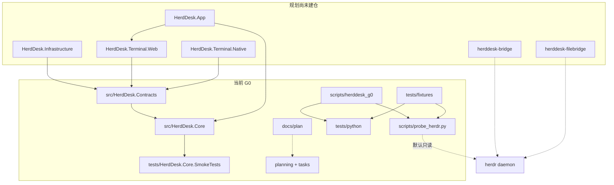

# HerdDesk（牧台）

生成日期：2026-09-08。本文件是仓库级 AI 索引；模块细节见各目录 `CLAUDE.md`。流程约束见 [AGENTS.md](AGENTS.md) 与 `.trellis/`。

独立 Windows 客户端，对接 herdr。GitHub 仓库名 `HerdrDesk`；应用名、solution、C# namespace 为 `HerdDesk`。中文工作名：牧台。当前阶段 **G0**；WinUI 产品窗口、生产 RPC/SSH/file bridge、安装包均未交付。G0 门禁未通过。48 项产品验收标准全部为 `not_run`。

herdr 拥有 agent 与 PTY。HerdDesk 只拥有连接。关闭 GUI 只释放本应用子进程。默认观察。控制、takeover、输入、上传均需明确授权。断线后不重放输入。

## 当前状态

| 项 | 值 |
|---|---|
| 阶段 | G0，`implementation/status.json` 中 `phase_gate=not_passed` |
| 活动任务 | HD-001 / HD-002 `in_progress`；HD-003 / HD-004 `blocked`；HD-005–036 `planned` |
| Python unittest | 73 项，`tests/python` |
| probe selftest | 23 项合成检查，不执行 herdr |
| C# smoke | 22 项，`dotnet run`，不是 `dotnet test` |
| CI | `.github/workflows/ci.yml`，Windows + Linux；范围限于离线 G0 |
| 上游基线 | herdr v0.8.2 commit `9eb521456ac0d19d3ab3d9d7cea3cca10baa8a4c`，`api_protocol=20` |
| 许可 | 项目级许可证未选定；见 `LICENSE-STATUS.md` |

已通过的 CI 只证明对应 SHA。后续提交读取自己的 Actions 结果。Hosted Windows runner 成功不等于交互桌面、IME 或真实 herdr 验收。

## 架构

当前仓库实现 BCL-only 契约、单连接帧解析、输入策略标本，以及 Python 诊断探针。规划目标：WinUI 外壳、.NET 10 LTS、独立 Core、可替换终端 renderer、自有 `herddesk-bridge`、系统 OpenSSH。P4 另增按调用启动的 `herddesk-filebridge`，与 RPC bridge 分离。

两条通信平面必须分离：JSON RPC（snapshot / 事件订阅）走 API socket 或自有 bridge；终端帧走 `herdr terminal session` 的 stdio。禁止把 JSON RPC 发到 herdr 二进制 client socket。远端使用 `ssh -T`；stdout banner 视为协议污染。文件面不解析 `ls` 文本。



依赖方向：Contracts 只依赖 BCL。Core 只依赖 Contracts。App / renderer / Infrastructure 尚未建仓。禁止 Core 引用 WinUI、WebView2、SSH 或 OS 凭据。

## 模块索引

| 路径 | 职责 | 索引 |
|---|---|---|
| [src](src/CLAUDE.md) | C# solution 入口 | 已生成 |
| [src/HerdDesk.Contracts](src/HerdDesk.Contracts/CLAUDE.md) | 身份、帧、输入决策类型 | 已生成 |
| [src/HerdDesk.Core](src/HerdDesk.Core/CLAUDE.md) | 单 epoch 帧解析器与输入策略 | 已生成 |
| [tests](tests/CLAUDE.md) | 三套检查的导航 | 已生成 |
| [tests/HerdDesk.Core.SmokeTests](tests/HerdDesk.Core.SmokeTests/CLAUDE.md) | C# G0 smoke runner | 已生成 |
| [tests/python](tests/python/CLAUDE.md) | Python 回归，73 项 | 已生成 |
| [tests/fixtures](tests/fixtures/CLAUDE.md) | 合成 NDJSON / 案例 | 已生成 |
| [scripts](scripts/CLAUDE.md) | Python 协议库、探针、结构校验、发布脚本 | 已生成 |
| [docs](docs/CLAUDE.md) | ADR、发布记录、许可清点 | 已生成 |
| [docs/plan](docs/plan/CLAUDE.md) | 12 专题规划档案与拟建契约 | 已生成 |
| [planning](planning/CLAUDE.md) | 活动 backlog、验收、风险 | 已生成 |
| [tasks](tasks/CLAUDE.md) | HD-001–036 正文 | 已生成 |
| [evidence](evidence/CLAUDE.md) | 兼容性基线与工具链快照 | 已生成 |
| [implementation](implementation/CLAUDE.md) | 已运行检查的 JSON | 已生成 |
| [.github](.github/CLAUDE.md) | G0 CI | 已生成 |

尚未建仓、仅出现在规划中的模块：`HerdDesk.App`、`HerdDesk.Infrastructure`、`HerdDesk.Terminal.Web`、`HerdDesk.Terminal.Native`、`bridge/`、`herddesk-filebridge`。HD-007 仍为 `planned`：现有 CI 是 G0 建仓准备。

`docs/plan/` 保存原规划正文。活动状态以根目录 `planning/` 与 `tasks/` 为准。`docs/implementation-g0.md` 是建仓前历史记录；其中“未推送”“C# 未编译”不代表当前托管状态。

## 领域用语

按 `docs/plan/docs/02_产品定义与名称.md` 与 `03_架构与数据流.md` 使用下列名称：

| 名称 | 含义 |
|---|---|
| DeviceId | 用户配置中的稳定 UUID |
| SessionKey | 设备 + endpoint + 可选 named session |
| PaneKey | SessionKey + workspaceId + paneId |
| ConnectionEpoch | 每次重建连接递增；旧 epoch 输入一律拒绝 |
| TerminalAccess | Disconnected / Observing / Acquiring / Controlling / Unknown |
| ControlVerified | 仅当适配器证明拥有输入权后为 true；首帧、进程存活、窗口聚焦均不能置位 |
| terminal.frame | 上游 ANSI 重建帧；`bytes` 为 canonical Base64；`full` 是重绘属性 |
| herddesk-bridge | 拟建 RPC 字节转发 sidecar；不是 herdr 已有命令 |
| herddesk-filebridge | 拟建按调用文件 helper；P4 锁协议；不是 SFTP 宣称 |
| workspace | UI 中文「工作区」；内部类型保留英文 |
| session | UI 中文「会话」；不得与 workspace 互换 |

pane ID、窗口标题、agent 类型不能单独当全局主键。终端 `seq` 只在本连接 epoch 内比较。

仓库内无 `CONTEXT.md`。代码与规划共用上述名称。`docs/plan/contracts/HerdDesk.Contracts.cs` 是拟建端口草案，比 `src/HerdDesk.Contracts/TerminalModels.cs` 更大；后者才是已编译源码。

## 全局标准

- SDK：`global.json` 固定 `10.0.400`，`rollForward=disable`。目标框架 `net10.0`。`TreatWarningsAsErrors`、nullable、确定性编译。
- G0 C# 禁止 `PackageReference`。`NuGet.Config` 清空包源。`scripts/validate_repository.py` 会断言这一点。
- Python 3.10+，仅标准库。测试通过 `sys.path` 引入 `scripts/`。
- 元数据 JSON/Markdown 用 UTF-8 读取。fixture 固定 LF。`.gitattributes` 将文本设为 `eol=lf`。
- 客户端限额：NDJSON 行 16MiB、解码帧 8MiB、输入 64KiB、JSON 深度 64。超限停止当前连接，不截断、不丢 delta。
- 终端字节保持原始；禁止对每一帧孤立 `UTF8.GetString`。UTF-8 字符可跨帧分割。
- 错误码稳定、脱敏。诊断不得包含终端正文、凭据、私人路径。
- 真实探针报告写入 gitignored `probe-results/`。公开仓库只提交合成数据。
- `scripts/publish_github.py --publish` 是历史建仓入口。已有仓库禁止运行。后续用 branch/PR，不 force-push。
- Python `herddesk_g0.protocol` 与 C# `TerminalFrameParser` 独立实现，共享 fixture 意图。后续需要跨语言一致性测试。
- 测试分 L0–L4。当前 CI 只覆盖离线 L0/L1。性能数字是规划预算，尚未实测。
- `evidence/toolchain.json` 是首次本地环境快照；其中 `github_actions_status=not_run` 已被 `implementation/status.json` 取代。
- 草案 `docs/plan/contracts/HerdDesk.Contracts.cs` 不得整文件覆盖 `src/HerdDesk.Contracts`。

## 常用命令

```powershell
python -m unittest discover -s tests/python -v
python scripts/probe_herdr.py selftest
python scripts/check_capture.py tests/fixtures/terminal-valid.ndjson
python scripts/validate_repository.py
dotnet build HerdDesk.slnx --configuration Release
dotnet run --project tests/HerdDesk.Core.SmokeTests --configuration Release --no-build
```

可写探针必须指定 disposable target，输入另需 `--allow-input`。只终止探针自己的直接子进程。

## 建议阅读顺序

1. 本文件与 `README.md`、`implementation/status.json`
2. 将要改的模块 `CLAUDE.md`
3. 对应 `tasks/HD-xxx.md` 与 `planning/acceptance.json`
4. `docs/plan` 中该层专题（协议用 05，SSH/文件用 07，测试用 10）

## 索引元数据

- 覆盖：C# 产品源码 5/5；Python `protocol.py` 与 `probe_herdr.py` 全文；4 个测试文件的 73 个 `test_`；规划 12 专题均已摘要；契约草案全文；G0/P1 任务正文；AC01–AC48；R01–R14；CI 工作流。
- 模块索引：15 个目录 `CLAUDE.md` + 根文件。
- 忽略：`.trellis/`、各 Agent 工具目录、`bin/`、`obj/`、`probe-results/`、二进制、`PUBLICATION_MANIFEST.json` 逐文件 hash 表。
- 未逐文件通读：HD-009–036 正文（已用 backlog/专题 09 制表）、`docs/plan/evidence/版本与证据索引.md` 各 E 号条目、NDJSON 逐行内容。
- 下次若继续：`docs/plan/evidence/版本与证据索引.md`、P2+ 任务正文、fixture 字节级对照 C#/Python。
