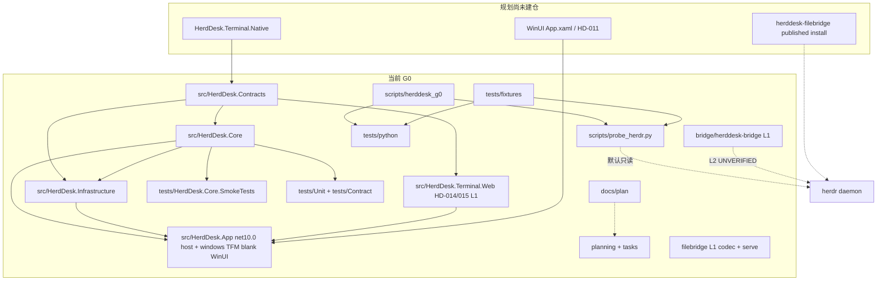

# HerdDesk（牧台）

共用项目事实与授权边界以 [AGENTS.md](AGENTS.md) 为准。本文件是模块索引，不是第二份项目事实正文。

五套工具的入口、派发、模型/权限核对与 CLI 缺失回退见 [docs/harness-workflows.md](docs/harness-workflows.md)。G0 C#/Python 规范见 [.trellis/spec/backend/](.trellis/spec/backend/index.md)。WinUI/React 模板为 deferred，见 [.trellis/spec/frontend/index.md](.trellis/spec/frontend/index.md)。流程见 [AGENTS.md](AGENTS.md) 中的 Trellis 块与 `.trellis/workflow.md`。

独立 Windows 客户端，对接 herdr。GitHub 仓库名 `HerdrDesk`；应用名、solution、C# namespace 为 `HerdDesk`。中文工作名：牧台。

从仓库根或 `src/HerdDesk.Core` 启动时，先读根目录 [AGENTS.md](AGENTS.md)：阶段 **G0**；离线门禁 `just ci`；禁止真实 herdr/SSH/WinUI 写入；批准计划后才实施。不要把 G0 或 AC01–AC48 标为通过。

## 当前状态

权威字段在 `implementation/status.json`、`planning/acceptance.json` 与 `tasks/HD-*.md`。`phase_gate=not_passed`。AC01–AC48 为 `not_run`。测试条目计数可能落后于后续提交；以本次 `just ci` 为准。

| 项 | 值 |
|---|---|
| 阶段 | G0 |
| 离线门禁 | `just ci`（与 `.github/workflows/ci.yml` 同步骤） |
| 上游基线 | 规划钉 GitHub **v0.9.0** commit `b99002ac99b09e00b4ca692436cb15a6b0d676f1`，`protocol=22`。历史对照 v0.8.2 / protocol 20。本机 preview 不得写入 `compatible_by_default` |
| 许可 | 项目级许可证未选定；见 `LICENSE-STATUS.md` |

已通过的 CI 只证明对应 SHA。Hosted Windows runner 成功不等于交互桌面、IME 或真实 herdr 验收。HD-011 L1 ViewModels 不是 AC19 或 WinUI 通过。HD-014 L1 renderer ports 不是 AC08 或 WebView2 通过。HD-015 L1 IME/keyboard coordinators 不是 AC09/AC10 或真机 IME 通过。HD-016 L1 ControlLeaseCoordinator 不是 AC07/AC14/AC16 或 live lease 通过。HD-019 L1 catalog/composition 不是 AC06/AC07/AC10/AC15 或本地 MVP 通过。HD-021 L1 helper publish 状态机不是 AC25 或 live deploy 通过。HD-026 L1 收口目录不是 AC13/14/15/19/21/22/23/24/26 或 live SSH 通过。HD-032 L1 收口目录不是 AC31/32/33/34/35 或 live FS/SSH/TOCTOU 通过。HD-033 L1 收口目录加 L2 Narrator 存在性 overlay 不是 AC27/28/29/37/38/46 或 live soak / 输入到像素 / DPI / Narrator 通过。HD-034 L2 未签名 layout 叠加不是 AC41/AC42 或 live 安装/签名/更新/回滚 通过。HD-035 L1 收口目录加 L2 工作树 auditor overlay 不是 AC02/AC43/AC44 或 live 扫描/renderer 进程/canary/已签名包反向审计 通过。HD-036 L1 收口目录加 L2 hosted-workflow pointer overlay 不是 AC39/AC40/AC45/AC47/AC48 或独立用户走查 / 平台矩阵 / 最终 SHA 绑定 / 干净还原 / HEAD required-check / 发布 / 签名 hash。Hosted workflow 不是 required-check。不是完整 1.0。

## 架构

当前仓库实现 BCL-only 契约、单连接帧解析、输入策略标本、配置/诊断基础设施、组合根宿主 stub、Python 诊断探针，HD-008 L1 `bridge/herddesk-bridge` 字节转发，HD-027 L1 `filebridge/` 协议 codec，以及 HD-028 L1 `herddesk-filebridge serve` 与本地文件端口。HD-007 L2 准入 App windows TFM 的 WinUI 2.3.6 lock 与空白 `App.xaml`/`MainWindow`。WinUI Shell 内容与 Native renderer 尚未建仓。named-pipe ACL 与 filebridge L2 FS/SSH 仍为 UNVERIFIED。

两条通信平面必须分离：JSON RPC 走 API socket 或自有 bridge；终端帧走 `herdr terminal session` 的 stdio。禁止把 JSON RPC 发到 herdr 二进制 client socket。远端使用 `ssh -T`；stdout banner 视为协议污染。文件面不解析 `ls` 文本。

依赖方向：Contracts 只依赖 BCL。Core 只依赖 Contracts。禁止 Core 引用 WinUI、WebView2、SSH 或 OS 凭据。



## 模块索引

编辑某目录前读该目录的 `CLAUDE.md`。不要把 [AGENTS.md](AGENTS.md) 复制进每个模块。

| 路径 | 职责 | 索引 |
|---|---|---|
| [src](src/CLAUDE.md) | C# solution 入口 | 已生成 |
| [src/HerdDesk.Contracts](src/HerdDesk.Contracts/CLAUDE.md) | 身份、帧、输入决策、配置/诊断端口 | 已生成 |
| [src/HerdDesk.Core](src/HerdDesk.Core/CLAUDE.md) | 单 epoch 帧解析器与输入策略、HD-023 L1 多设备聚合 | 已生成 |
| [src/HerdDesk.Infrastructure](src/HerdDesk.Infrastructure/CLAUDE.md) | 配置存储、诊断、RPC stdio | 已生成 |
| [bridge](bridge/CLAUDE.md) | herddesk-bridge L1 字节转发 | 已生成 |
| [filebridge](filebridge/CLAUDE.md) | HD-027 codec + HD-028 L1 `herddesk-filebridge serve` | 已生成 |
| [src/HerdDesk.Terminal.Web](src/HerdDesk.Terminal.Web/CLAUDE.md) | HD-014 L1 message validator + BCL renderer adapter + HD-015 L1 input coordinators；L2 npm/WebView2 在 `web/terminal/` 与 App windows TFM | 已生成 |
| [src/HerdDesk.App](src/HerdDesk.App/CLAUDE.md) | 组合根宿主 stub + HD-011 L2 四区 WinUI Shell + L1 ViewModels + HD-015 L1 focus/input + HD-029 L1 文件工作区 ViewModels + HD-030 L1 AttachToAgentViewModel + HD-031 L1 PastePreviewViewModel | 已生成 |
| [tests](tests/CLAUDE.md) | 检查导航 | 已生成 |
| [tests/HerdDesk.Core.SmokeTests](tests/HerdDesk.Core.SmokeTests/CLAUDE.md) | C# G0 smoke runner | 已生成 |
| [tests/Unit/HerdDesk.Core.Tests](tests/Unit/HerdDesk.Core.Tests/CLAUDE.md) | Core unit runner | 已生成 |
| [tests/Unit/HerdDesk.Infrastructure.Tests](tests/Unit/HerdDesk.Infrastructure.Tests/CLAUDE.md) | Infrastructure unit runner | 已生成 |
| [tests/Contract](tests/Contract/CLAUDE.md) | Contract runner | 已生成 |
| [tests/python](tests/python/CLAUDE.md) | Python 回归 | 已生成 |
| [tests/fixtures](tests/fixtures/CLAUDE.md) | 合成 NDJSON / 案例 | 已生成 |
| [scripts](scripts/CLAUDE.md) | Python 协议库、探针、结构校验、发布脚本 | 已生成 |
| [docs](docs/CLAUDE.md) | ADR、发布记录、许可清点、harness 工作流 | 已生成 |
| [docs/plan](docs/plan/CLAUDE.md) | 12 专题规划档案与拟建契约 | 已生成 |
| [planning](planning/CLAUDE.md) | 活动 backlog、验收、风险 | 已生成 |
| [tasks](tasks/CLAUDE.md) | HD-001–036 正文 | 已生成 |
| [evidence](evidence/CLAUDE.md) | 兼容性基线与工具链快照 | 已生成 |
| [implementation](implementation/CLAUDE.md) | 已运行检查的 JSON | 已生成 |
| [.github](.github/CLAUDE.md) | G0 CI | 已生成 |

尚未建仓、仅出现在规划中的模块：`HerdDesk.Terminal.Native`。HD-007 L2 已准入 `App.xaml`/`MainWindow` 与 WinUI 2.3.6 lock。HD-011 L2 已填四区 Shell XAML；L2 视觉/激活与 L3 IME/DPI 仍为 UNVERIFIED。`bridge/herddesk-bridge` 为 HD-008 L1；named-pipe ACL L2 仍 UNVERIFIED。`filebridge/` 为 HD-027 codec 加 HD-028 L1 serve；L2 FS/SSH/TOCTOU UNVERIFIED。AC39/AC40/AC47 与 `phase_gate` 仍未通过。

`docs/plan/` 保存原规划正文。活动状态以根目录 `planning/` 与 `tasks/` 为准。`docs/implementation-g0.md` 是建仓前历史记录；其中“未推送”“C# 未编译”不代表当前托管状态。

## 领域用语

按 `docs/plan/docs/02_产品定义与名称.md` 与 `docs/plan/docs/03_架构与数据流.md` 使用下列名称：

| 名称 | 含义 |
|---|---|
| DeviceId | 用户配置中的稳定 UUID |
| SessionKey | 设备 + endpoint + 可选 named session |
| PaneKey | SessionKey + workspaceId + paneId |
| ConnectionEpoch | 每次重建连接递增；旧 epoch 输入一律拒绝 |
| TerminalAccess | Disconnected / Observing / Acquiring / Controlling / Unknown |
| ControlVerified | 仅当适配器证明拥有输入权后为 true；首帧、进程存活、窗口聚焦均不能置位 |
| terminal.frame | 上游 ANSI 重建帧；`bytes` 为 canonical Base64；`full` 是重绘属性 |
| herddesk-bridge | 拟建 RPC 字节转发 sidecar；不是 herdr 已有命令 |
| herddesk-filebridge | 按调用文件 helper；v1 wire 为 HD-027/HD-028 L1（ADR-0008 accepted，wire only）；L2 live FS/SSH UNVERIFIED；不是 SFTP 宣称 |
| workspace | UI 中文「工作区」；内部类型保留英文 |
| session | UI 中文「会话」；不得与 workspace 互换 |

pane ID、窗口标题、agent 类型不能单独当全局主键。终端 `seq` 只在本连接 epoch 内比较。

仓库内无 `CONTEXT.md`。代码与规划共用上述名称。`docs/plan/contracts/HerdDesk.Contracts.cs` 是拟建端口草案，比 `src/HerdDesk.Contracts/TerminalModels.cs` 更大；后者才是已编译源码。

## 编译与限额

细则在 [AGENTS.md](AGENTS.md) 与 [.trellis/spec/backend/](.trellis/spec/backend/index.md)。摘要：SDK 以 `global.json` 为准；除 App windows TFM 已准入的 `Microsoft.WindowsAppSDK.WinUI` 2.3.6 外无 `PackageReference`；Python 3.10+ 仅标准库；NDJSON 行 16MiB、解码帧 8MiB、输入 64KiB、JSON 深度 64；终端字节保持原始；错误码稳定、脱敏。

## 常用命令

```powershell
just ci
python -m unittest discover -s tests/python -v
python scripts/probe_herdr.py selftest
python scripts/check_capture.py tests/fixtures/terminal-valid.ndjson
python scripts/validate_repository.py
dotnet restore HerdDesk.slnx
dotnet build HerdDesk.slnx --configuration Release -p:HerdDeskBclOnly=true --no-restore
dotnet format HerdDesk.slnx --verify-no-changes --no-restore
dotnet run --project tests/HerdDesk.Core.SmokeTests --configuration Release --no-build
dotnet run --project tests/Unit/HerdDesk.Core.Tests --configuration Release --no-build
dotnet run --project tests/Unit/HerdDesk.Infrastructure.Tests --configuration Release --no-build
dotnet run --project tests/Unit/HerdDesk.App.Tests --configuration Release --no-build
dotnet run --project tests/Unit/HerdDesk.Terminal.Web.Tests --configuration Release --no-build
dotnet run --project tests/Contract/HerdDesk.ContractTests.csproj --configuration Release --no-build
```

可写探针必须指定 disposable target，输入另需 `--allow-input`。只终止探针自己的直接子进程。

## 建议阅读顺序

1. [AGENTS.md](AGENTS.md)，然后本索引、`implementation/status.json`
2. [docs/harness-workflows.md](docs/harness-workflows.md)（跨工具派发）
3. 将要改的模块 `CLAUDE.md`
4. 对应 `tasks/HD-xxx.md` 与 `planning/acceptance.json`
5. `docs/plan` 中该层专题（协议用 05，SSH/文件用 07，测试用 10）
