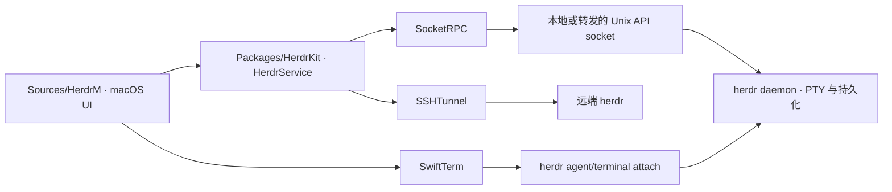
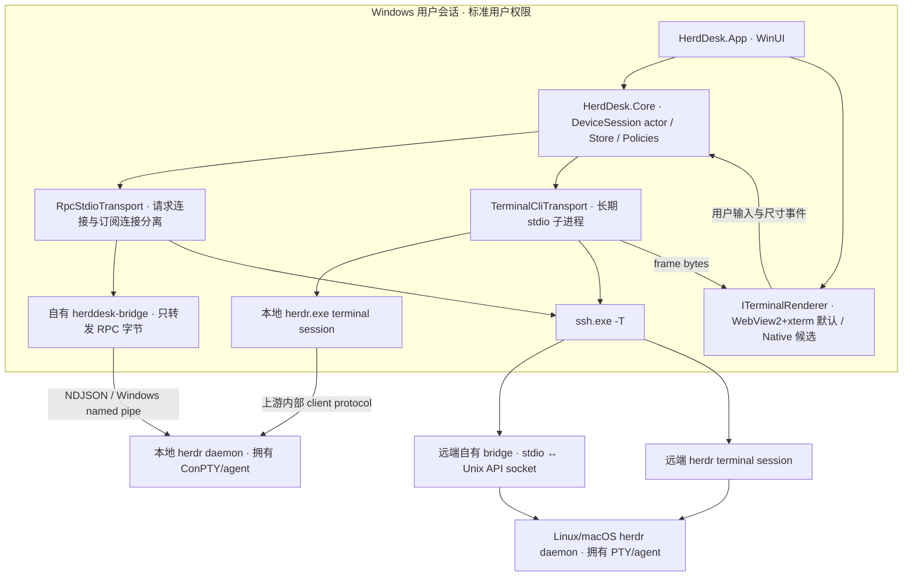
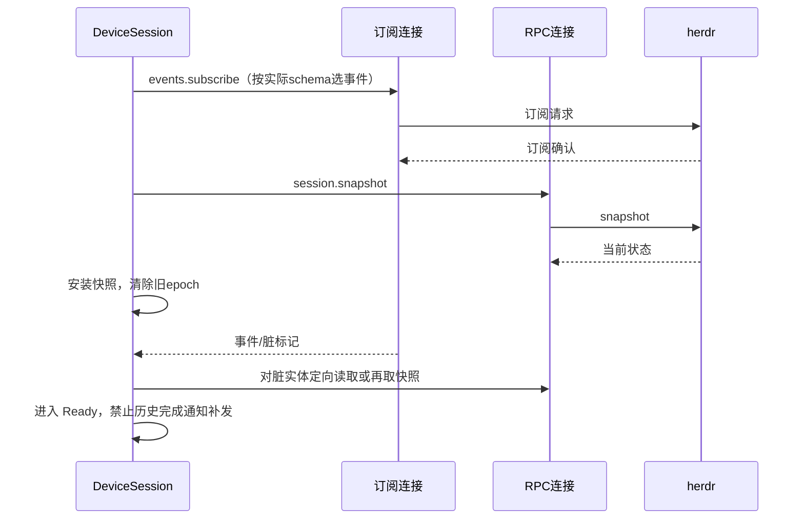
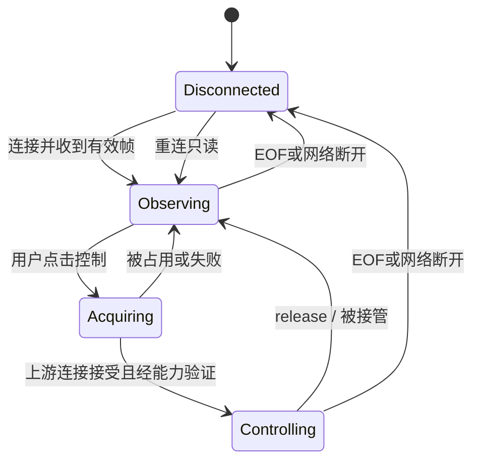

# 03 · 架构与数据流

## 1. 上游现状：基于已读依赖关系



UI 对 SwiftTerm 与 HerdrKit 的依赖由 `project.yml` 确认；HerdrService 的 `connect()` 明确区分 local/SSH，持有 SocketRPC 与 SSHTunnel；attach 行为在 README 中声明，未据 README 编造终端 UI 类名或其内部调用行号。[E02](../evidence/版本与证据索引.md#e02) [E09](../evidence/版本与证据索引.md#e09) [E14](../evidence/版本与证据索引.md#e14)

## 2. 目标：原生桌面 + 独立领域层 + 两条通信平面



**“自有 bridge”是本计划新增组件，不是 herdr 已有命令。** 它只适配 stdio 与平台 socket，不解析业务、不创建 shell、不提供公网端口。Windows 端使用与目标 herdr 基线相容的 `interprocess` 命名空间映射；远端用 Unix socket。这样不用在 C# 中猜测某个 config 路径如何转换成 named pipe 名，且能共用跨平台 transport 测试。`src/ipc.rs:1–170` 支持这一设计依据。[E06](../evidence/版本与证据索引.md#e06)

同一设备/session 通常有一条 RPC 请求连接、一条事件订阅连接；仅可见 pane 拥有终端桥进程。起步限制最多 4 个可见 pane、最多 3 个远端设备，隐藏 pane 不持续渲染。数量上限为产品预算，非上游限制；后台状态仍由事件连接维护。需要更大规模时先测进程数、SSH MaxSessions 与服务器负载。

### 不可打破的五条架构约束

1. herdr 是运行状态的唯一权威；本地 Store 是可丢弃投影，不能反向覆盖服务器真实状态。
2. App/renderer 不能持有任意 shell 执行器；特权操作从领域服务经过 capability/ownership/policy 检查。
3. 终端 API 请求与终端帧流分离；JSON RPC 不能发往 herdr 的二进制 client socket。
4. 关闭 GUI 只释放桥与 SSH 子进程，不执行 server stop，不枚举杀死 agent，不把 daemon 放入随 UI 退出销毁的 Job Object。
5. 断线后不重放输入字节；连接恢复先只读校准，再由用户重新申请控制。

## 3. 模块边界与依赖方向

| 拟建模块 | 职责 | 允许依赖 | 禁止承担 |
|---|---|---|---|
| HerdDesk.Contracts | ID、frames、capabilities、port interfaces | BCL | WinUI、ssh 进程、RPC 具体方法 |
| HerdDesk.Core | DeviceSession 状态机、操作策略、未读、错误语义 | Contracts | XAML、WebView2、OS 凭据 |
| HerdDesk.Infrastructure | 进程、stdio/RPC、配置、凭据、SSH | Contracts/Core ports | UI 控件、隐式创建工作区 |
| HerdDesk.Terminal.Web | xterm 适配、焦点、输入来源、回压确认 | Contracts；本地 JS 资源 | 文件系统、任意 URL/任意 RPC |
| HerdDesk.Terminal.Native | 可选 native adapter | Contracts | 另建一套 domain 或 server |
| HerdDesk.App | XAML、ViewModel、系统通知、命令编排 | Core + adapters | 大段协议解析、SSH 引号拼接 |
| bridge/ | stdio↔socket，平台映射，连接关闭 | Rust std/interprocess | daemon 管理、授权绕过、网络监听 |

依赖倒置通过 interfaces 完成；采用模块化单体和少量 sidecar，不引入微服务、消息中间件或独立数据库服务器。配置/最近使用/未读可用版本化 JSON 原子写入，业务运行状态不落数据库；需要大规模诊断索引时再评估 SQLite。

## 4. 身份与并发模型

`DeviceId` 是用户配置中的稳定 UUID；`SessionKey` 包含设备和命名 session/显式 endpoint；`PaneKey` 还包含 workspace、pane；`ConnectionEpoch` 在每次重建连接时递增。pane ID、agent 类型、目录或窗口标题均不能单独当全局主键。终端 `seq` 只在本桥连接的 epoch 内比较，不能当跨设备时钟或持久事件游标。

每个 DeviceSession 由一个串行 actor/事件循环管理 Store mutation；网络读取、Base64 解码与文件传输不在 UI 线程执行。RPC pending-request map 由唯一请求 ID 关联响应，取消后移除 pending；晚到响应仅记录诊断，不应用到新 epoch。

## 5. 首次同步及重连的竞态策略



**不能假设事件含可回放序列号或 snapshot revision。** MVP 把事件视为“权威状态可能变化”的失效通知：先订阅并确认，再取 snapshot，订阅期间累计 dirty；随后按 dirty 重新读取受影响实体。无实体 getter 或不确定时重新 snapshot。250ms 合并窗口、5s 周期性校准和断线后全量同步是初始策略，需按实际负载调整。此策略优先收敛正确性，不声称对每次瞬态状态提供 exactly-once 通知。

通知对同一个业务状态转换做去重，首次快照建立基线不触发 done 历史通知；网络失联状态显示“过期”，不能保持绿色在线。错过的瞬态事件无法从无持久游标的流中凭空恢复，产品要说明。

## 6. 控制权与生命周期



上游 control stdio 未提供逐输入 ACK，也不能仅因子进程尚未退出就确定控制权已获得。G0 必须找出拒绝、takeover、release 的可观察输出；不够明确时状态停在“申请中/未知”，由适配器补充检测，而不是假造 `terminal.granted` 消息。GUI 的主动关闭、桥 EOF、server shutdown、pane exit 要有不同原因码。

## 7. 目标目录（拟建，不是现有仓库）

```text
src/HerdDesk.App/
src/HerdDesk.Contracts/
src/HerdDesk.Core/
src/HerdDesk.Infrastructure/
src/HerdDesk.Terminal.Web/
src/HerdDesk.Terminal.Native/   # 条件实现，不阻塞首发
bridge/
web/terminal/
tests/Unit/
tests/Contract/
tests/Integration.Windows/
tests/E2E/
docs/adr/
```

不建议直接以 herdi-win 托盘工程生长全部产品：可参考通知交互，但应先核验源码许可、框架生命周期和 transport 能力。也不把完整 Wintty 应用当作随取随用的嵌入库。[E27](../evidence/版本与证据索引.md#e27) [E28](../evidence/版本与证据索引.md#e28)
