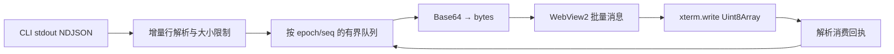

# 06 · 终端、输入法与流控

## 1. 先辨别字节的来源

服务端 `ClientRenderState::TerminalAnsi` 使用 BlitEncoder 保存基线、按帧产生差分，并在成功提交后更新 seq；因此接收到的是“用于重建终端视图的 ANSI 帧”，不是保证完整逐字节原始应用 stdout 的日志。生成帧和直接 PTY 透传必须在产品文案、测试与缓存策略中区分。[E05](../evidence/版本与证据索引.md#e05)

由此得到三个设计决定：不把 frame bytes 当原始训练日志导出；不把 xterm 本地 scrollback 当 herdr 权威历史；不以最新一帧覆盖尚未应用的所有 delta。需要原始日志时使用任务自身的日志文件，属于独立文件读取功能。

## 2. 字节管线与背压

UI 线程只接收小型状态变更和呈现调度；stdio reader、Base64 与 IPC 在后台。xterm `write()` 是异步解析，必须通过 callback 控制应用级在途窗口；callback 不能作为显示器上的呈现时间点。高输出时暂停向 renderer 派发，触发上游读取背压；不能无限积累字符串。[E23](../evidence/版本与证据索引.md#e23) [E25](../evidence/版本与证据索引.md#e25)

UTF-8 跨 frame 可能分割多字节字符；使用 Uint8Array 写入，或明确保持 decoder 状态，不对每一帧孤立做 UTF8.GetString。Unknown ANSI 不能用全局正则“清理”以免破坏合法序列；安全限制按 parser handler 或专用策略实施。

发生 seq 回退/缺口、renderer 崩溃或 epoch 不匹配，停止交互，销毁该视图的局部基线并重新 observe 获取可重建视图。只有经过验证的新连接 full frame 才能恢复 Ready；不向上游发送未经定义的“requestFullFrame”。重连时不沿用旧 seq，也不将旧回执释放新连接的缓冲配额。

## 3. 终端模式双重解释风险

上游自身已模拟 PTY 终端，前端又解释服务端产生的 ANSI；模式传递不能仅凭 renderer 支持列表推定成功。具体检查 bracketed paste、application cursor、mouse reporting、alternate screen、光标可见性、焦点报告、键盘增强和 DSR/DA 回复。

观察者不得因 xterm 自动响应查询而写回输入。控制者同样需要区分“用户键入”和“终端模拟器自动回复”；若上游已消费某类查询，再注入回复会污染 agent。为输入加来源字段，默认只转发经过策略允许的真实用户输入；是否需要 relay 自动应答由 G0 的模式探针决定。

独立 `Graphics` 消息在当前桥中被忽略，但服务端可能把 graphics 字节放进 terminal frame。1.0 不承诺 Kitty/Sixel 全保真；必须分别测模式、图像传输与 renderer 支持，不能用“有 GPU”作为图片协议支持的证明。[E04](../evidence/版本与证据索引.md#e04) [E05](../evidence/版本与证据索引.md#e05)

## 4. 中文 IME 与键盘验收

| 组别 | 操作 | 必须观察的结果 |
|---|---|---|
| 中文预编辑 | 微软拼音输入多字候选、不提交 | 候选窗位置靠近真实光标；未提交文字不发送 |
| 中文提交 | 回车选词、空格选词、切中英文 | 恰好一次 commit，不重复、不吞首字 |
| 快捷键冲突 | composition 期间 Ctrl+K / Enter / Esc | IME 优先；不突然切 pane 或提前提交 prompt |
| 文本形态 | 中文+英文+emoji+组合音标 | 不出现断字替换字符；光标和选择正确 |
| 修饰键 | AltGr、左右 Ctrl/Alt、Ctrl+C、Ctrl+Z | 不将所有按键当普通文本；保留中断语义 |
| Agent 差异 | Shift+Enter、Tab、Esc、方向键、确认框 | 对每种 agent 记录真实版本和通过结果 |
| 高 DPI | 100/150/200%，跨显示器拖动 | 行列计算与渲染尺寸一致，不反复 resize |

WebView2/XAML focus 的转移要显式管理：点击 pane、搜索跳转、通知跳转都在 renderer ready 后聚焦；失焦不释放控制权，切到其他 pane 是否 release 由明确产品策略决定。默认单窗只允许一个交互 pane，其他可见 pane 观察。

## 5. 滚动与选择

服务端控制 viewport：控制状态下滚轮转成 `terminal.scroll`；普通鼠标点击等输入另经模式验证。观察状态不能发送 scroll 命令去改变他人 viewport，显示“只读，滚动由当前控制者决定”；若后续提供历史文本浏览，放在独立只读面板，不伪装为同一 VT scrollback。xterm local scrollback 初始设为 0，避免服务端屏幕重绘被误积累成日志；该值属于设计策略而非上游要求。[E04](../evidence/版本与证据索引.md#e04)

拖选优先本地文字选择；使用 Shift 等明确修饰键进入应用鼠标模式。复制只含选择文本，不附带隐藏转义字节。OSC 52 剪贴板读默认禁用，写入必须有策略；OSC 8 链接只触发受控 host 请求，绝不执行任意 URI handler。

## 6. 可访问性与性能目标

保留 xterm/原生控件可访问性能力，实际用 Windows 屏幕阅读器验证；不能因为 library 声称支持就给产品打勾。主题高对比下不只靠红绿区分状态。鼠标、键盘、屏幕阅读器三条路径均能申请/释放控制权。

性能基线见测试文档。优先限制“可见 pane 数”和帧排队，不开 100 个隐藏终端进程来维持侧边栏状态。高输出压测应同时验证文字正确性和 input-to-render 时延；只提高吞吐而让按键排队数秒属于失败。
